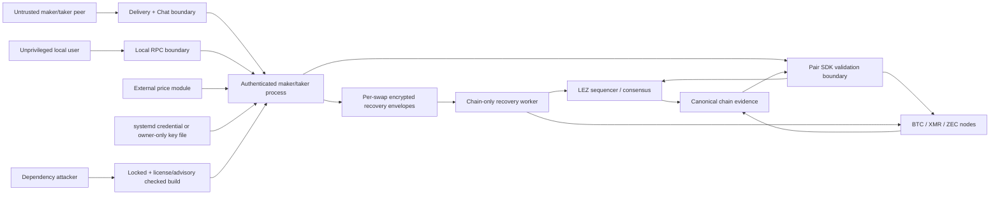

# Threat model

Status: review candidate; implementation evidence remains milestone-gated —
2026-07-11

## Assets and actors

Assets are maker/taker funds on LEZ and the foreign chain, adaptor secrets or
HTLC preimages, Monero spend-key shares, wallet keys, persisted recovery state,
price configuration, and daemon control authority.

Actors are the maker operator, taker user, potentially malicious counterparty,
chain miners/sequencers, Logos Delivery/Chat peers, local unprivileged users,
and a supply-chain attacker.

## Non-negotiable invariants

1. The maker never locks before the taker's foreign lock reaches pair-specific
   confirmation policy.
2. After the first lock, claim and refund need only persisted state and chain
   nodes.
3. No reachable terminal or intermediate state lets one party receive proceeds
   while preventing the other from claiming or eventually refunding.
4. LEZ refund becomes available before the foreign refund, with a margin that
   covers inclusion delay, reorgs, clock drift, and operator reaction.
5. Every swap has independent IDs, secrets, keys, transactions, deadlines, and
   database writes.
6. A crash may delay progress but cannot erase the data required to recover.
7. Refund safety depends on chain state and deadlines, never on which party's
   refund observation reaches the coordinator first.
8. Monero recovery is triggered by the canonical LEZ refund/key-share path; no
   component treats a Monero height as a native refund timelock.

## Cross-cutting threats and required evidence

| Threat | Failure | Mitigation/evidence |
|---|---|---|
| Maker locks on zero/insufficient confirmations | Taker reorgs or abandons lock | State transition rejects maker lock; adapters prove canonical confirmations |
| Delivery/Chat outage or malicious messages | Locked funds become unavailable | Persist negotiated transcript before lock; post-lock API has no transport dependency |
| Rollback/reorg after observation | Coordinator acts on non-canonical evidence | Regression/removal before maker lock revokes permission and permits explicit replacement; after maker lock the exact txid stays pinned, claims suspend, and refunds remain; pair finality/chain tests remain |
| Deadline off-by-one or mixed clocks | Refund unavailable at documented boundary | Typed chain/basis positions reject cross-domain comparison; conservative cross-chain bounds validate margin; LEZ `[from,to)` and pair boundaries remain executable gates |
| Missing/corrupt local state | Claim/refund material lost | SQLite FULL durability, encrypted secret handling, backups, restart/process-kill matrix |
| Backup without decryption key, or key without database | Recovery impossible after host loss | Operator runbook backs up the encrypted DB and master credential as two separately access-controlled artefacts and performs a restore drill before enabling non-demo value |
| Replay/duplicate chain event | Double transition or wrong swap mutation | Idempotency keys include pair, chain ID, txid, output index, and swap ID |
| Concurrent swap cross-talk | Wrong secret/account/UTXO used | Typed swap IDs, per-swap aggregates, DB primary keys, concurrent model/E2E tests |
| Local RPC takeover | Attacker changes price or triggers action | Current loopback adapter refuses remote bind and uses Bearer capability; production gate adds Unix peer permissions, credential file, least-privilege systemd unit, and audit log |
| Price-feed compromise | Economically harmful but valid swap | Bounds/staleness policy, operator limits, explicit source health; never weakens atomicity |
| Dependency compromise/license issue | Backdoor or redistribution failure | Lockfile, cargo-deny advisories/licenses/sources, minimal features, reviewed updates |
| Malicious/unsupported LEZ asset account | Wrong custom token or custody substitution | Metadata PDA, native vault PDA, ATA derivation, program owner, token definition, exact balance delta, and fixed destinations are all transcript-bound and guest-validated |
| Claim/refund race at LEZ boundary | Both branches appear usable or neither is includable | Claim validity ends at the exclusive refund timestamp; refund entitlement starts inclusively; exact before/at/after standalone-sequencer tests |

## Bitcoin-specific threats

- Adaptor pre-signature forgery or failed witness extraction: subject the
  exact-pinned Schnorr candidate to official BIP-340/BIP-327 vectors,
  swap-specific positive/negative fixtures, an independent implementation
  cross-check, and Core consensus; prove the claimed aEUF-CMA, witness
  extractability, and pre-signature adaptability assumptions. DLC's ECDSA
  adaptor corpus is not Schnorr evidence.
- Refund fragility: ADR 0009 selects a consensus-enforced Taproot script-path CSV
  refund. Validate exact boundary, key backup, current-fee construction, RBF/CPFP,
  and reorg behavior against Bitcoin Core.
- Signature byte mutation or signing bypass: extraction depends on the accepted
  BIP-340 scalar. The pinned v0.2 sequencer transaction-equality test is the
  byte-preservation gate; each BTC leg uses a distinct two-party aggregate
  authority bound to one exact message. No standalone actor key or direct-secret
  instruction is accepted, and each secret nonce is durably reserved, consumed
  once, then zeroized.
- UTXO replacement/fee starvation: bind exact outpoint/script/value and maintain a
  fee-bump path that cannot alter adaptor commitments.

## Monero-specific threats

- Invalid cross-curve DLEQ or subgroup handling: use COMIT/h4sh3d construction and
  published vectors; reject non-canonical points/scalars.
- Spend-key-share loss or partial transcript loss: persist encrypted shares and
  every signed recovery artefact before advancing.
- View/spend key confusion and wallet scan lag: separate typed keys and require
  canonical wallet/node observations before transitions.
- Counterparty disappears after witness exposure: recovery instructions must be
  derivable from persisted state without Chat.
- The maker-funded Monero output has no script/timelock. If the maker does not
  claim LEZ, the taker refunds LEZ and the resulting recovery-share path lets
  the maker spend XMR. The coordinator must not expose maker recovery before
  canonical LEZ refund evidence and must retain it after restart.
- Unsupported XMR-first funding: the pinned COMIT construction requires the
  scriptable leg first, so core term validation and CLI/daemon reject XMR-first.

## Zcash-specific threats

- Transparent-pool privacy confusion: UI and docs state that amounts, scripts,
  addresses, and linkage are public; shield-after-swap is guidance, not a property
  of the atomic swap.
- BIP-199 script branch or CLTV error: canonical script vectors, minimal script,
  exact transaction-version/branch-ID tests, and third-party review.
- `nExpiryHeight` or reorg interaction: expiry is distinct from refund CLTV;
  construction and fee policy must leave enough blocks for both claim and refund.
- Node transition risk: use Zebra, construct locally with canonical Zcash crates,
  and pin network-upgrade behavior.

## Secret storage and operator recovery decision

Secret material is persisted only as versioned per-swap envelopes encrypted
with RustCrypto `XChaCha20Poly1305`; keys are derived per swap and purpose with
HKDF-SHA256 from a random 256-bit master credential. Nonces come from the OS CSPRNG
and are never reused for a key. The implementation uses the maintained crates,
published algorithms, `secrecy`, and `zeroize`; it does not implement primitives.
Associated data binds schema version, swap ID, pair, direction, and terms hash.

The master credential is supplied through `systemd-creds` where available or an
owner-only file outside the database directory. It is never accepted through a
CLI argument or environment variable. Startup fails closed for encrypted swaps
when the credential is missing/wrong; read-only public history may remain
available. Rotation decrypts and re-encrypts each envelope transactionally,
leaving the old credential valid until the new database commit is durable.

Backups contain the SQLite database/WAL checkpoint and the credential as
separate artefacts. The operator flow requires a restore-and-recovery dry run;
logs and diagnostics contain only envelope IDs and redacted fingerprints.

## Parameter and implementation gates

The quantified `public-testnet-v1` depths, direction-specific horizons, margin
budgets, and XMR event-gated recovery are in
[the parameter profile](parameter-profiles.md). They are testnet acceptance
defaults, not audited mainnet settings.

The remaining work is evidence, not an unstated design choice:

- M2 compiles a minimal SPEL-generated program against the pinned LEZ commit,
  validates the metadata/native-vault/ATA model, and measures compute units;
- M2–M4 execute exact boundary, reorg, fee-stress, evidence-extraction, and
  chain-only recovery matrices per pair;
- M5 implements encrypted envelopes, credential rotation, backup restore,
  process-kill durability, local-RPC hardening, and concurrent isolation; and
- M7 reviews the escrow, scripts, cryptographic protocols, parameter assumptions,
  storage, and daemon boundary, with critical/high remediation required.
