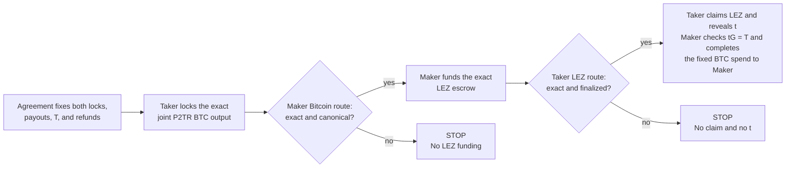
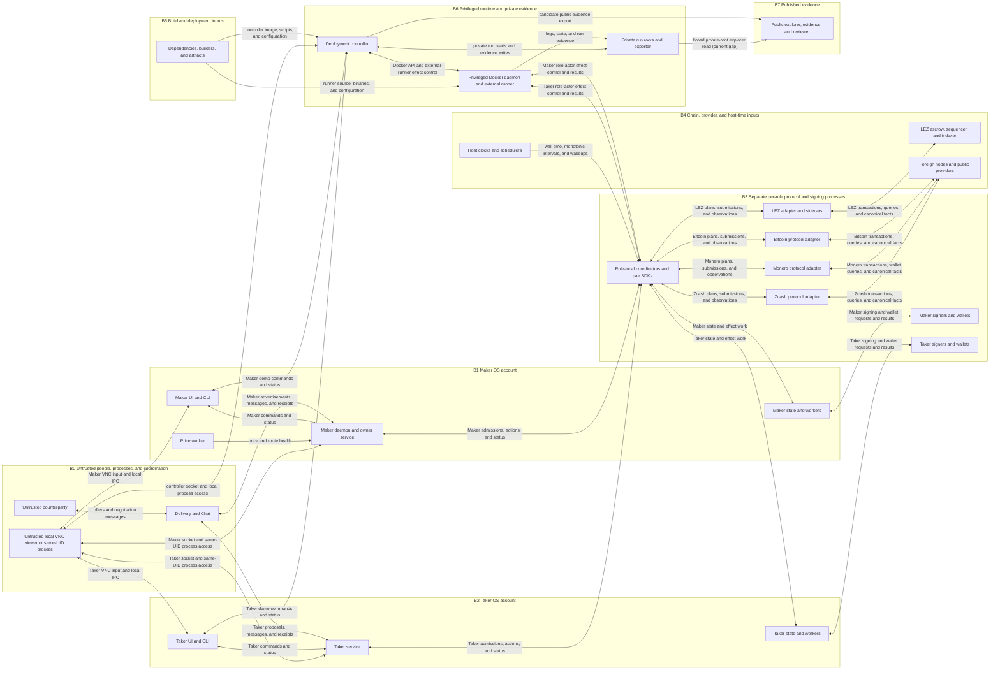

<!-- Generated from threat-model.json; run:
python3 scripts/check-threat-model.py --write
Resolve pinned implementation references when the source tree is available:
python3 scripts/check-threat-model.py --check --source-repo PATH -->

# LEZ atomic swaps threat model

## Scope

One global threat model for the integrated M1-M7 implementation. Milestones record where a feature entered; they do not limit threat scope. The model covers the full application, protocol, recovery, deployment, and evidence system. Public and production profiles remain in scope even when their controls are not yet verified.

Implementation: M7 functional baseline 5c384a5151f59bef1a2f19421ef6ab2b004db3d4 plus the runnable application tree 2888e8cf818143a7dce903f343fdbe70de9e267a.

Package: The M3+ package and deployment are reviewed at a8a3d6de3c8d9b5a5e0557c2de53cd53fa2dbbe8. Its narrower submission claims do not narrow this model.

Method: Shostack's four questions, with STRIDE for security, LINDDUN for privacy, and route-state analysis for atomicity.

Excluded:
- XMR-first swaps; admission must reject them.
- Shielded Zcash swap legs.
- Ethereum and other unimplemented pairs.
- Automatic legal or regulatory decisions.

## Routes

| Route | Supported directions |
|---|---|
| LEZ-BTC (`lez-btc`) | taker-sells-btc, taker-sells-lez |
| LEZ-XMR (`lez-xmr`) | taker-sells-lez |
| LEZ-transparent-ZEC (`lez-zec`) | taker-sells-zec, taker-sells-lez |

## Independent verification: Taker sells BTC

The Maker checks the signed network, transaction, output key, value, unspent state, and confirmation policy through its own Bitcoin route. The Taker checks the exact program, swap, asset, amount, accounts, custody, parties, and finality through its own LEZ route.

Reject means stop advancing; it cannot undo a finalized lock. Ordered refunds recover existing locks. The joint BTC key controls temporary custody, while the agreement-bound spend fixes the Maker's payout.

## System view

Boundary shorthand: B1-B3 show the production trust target, and B3 is repeated as separate Maker and Taker instances. Private-local evidence and the M3+ demo may collapse parts of B1-B3; TM-0001 tracks that gap.

## Invariants

- **INV-01:** The Taker funds the first leg. The Maker funds the second leg only after its own chain route verifies the exact first lock and cutoff. The Taker reveals only after its own chain route verifies the exact second lock. Missing or invalid evidence never authorizes the next step.
- **INV-02:** Before either lock, both signatures bind the roles, route, direction, networks, assets, amounts, destinations, transactions, recovery policy, and unique swap identity. For BTC, the joint Taproot key controls temporary custody; the exact agreement-bound spend fixes the beneficiary.
- **INV-03:** After the first lock, each role can finish every permitted claim or recovery path from protected local state and chain access without Delivery, Chat, or another signing round.
- **INV-04:** A replay, restart, race, or ambiguous response cannot change an effect's meaning, execute it twice, or make two terminal branches authoritative.
- **INV-05:** No permitted branch lets a party use a revealed claim or recovery secret on one chain and then recover the revealing leg.
- **INV-06:** Crashes, restores, and concurrent swaps cannot erase recovery data, reuse one-time signing material, or rearm spent authority.
- **INV-07:** Recovery order is route-specific: BTC recovers the Maker-funded leg first; ZEC claim order is LEZ reveal then ZEC claim, while no-reveal recovery is LEZ refund then ZEC refund; XMR is LEZ-first and uses Tag 14 authorization, Tag 15 claim, Tag 16 refund, and Tag 17 punishment. Tag 17 reveals no XMR share.
- **INV-08:** Maker, Taker, signer, wallet, UI, controller, and evidence authorities are separated and receive only the permissions their role needs.
- **INV-09:** Private run roots remain private. Published evidence is integrity-bound, reviewed, and contains neither secrets nor unnecessary cross-chain linkage.

## Risk and release posture

Likelihood and impact use a 1–5 scale. The checker computes Low, Medium, High, or Critical. Inherent risk ignores controls; current residual risk is the owner's estimate after cited controls. References provide traceability, not independent assurance.

Likelihood: 1 rare, 2 unlikely, 3 plausible, 4 likely or repeatable, 5 easy or expected. Impact: 1 negligible, 2 limited, 3 material but recoverable, 4 major loss or exposure, 5 irreversible principal or system-authority loss.

Current production residual estimate: 2 Critical, 26 High, 1 Medium, and 0 Low. Every schema-v1 row blocks a value-bearing release; verified closure or removal requires a future schema revision.

States: open means a blocking control gap remains; working means control work is active; checking means implemented but not independently validated. Schema v1 has no closed or accepted state.

## Threats

The table shows production inherent → current residual risk. Exact phases, profiles, DFD targets, classifications, milestone provenance, scores, legacy IDs, and evidence references remain in the canonical JSON source.

| ID | Area | Risk | What can go wrong | Response / owner |
|---|---|---|---|---|
| TM-0001 | Local access and control | Critical → High | A local UI, service, sidecar, compatibility process, or test controller acts with another role's authority. | Role-fixed owner services, Unix-socket custody, actor locks, and narrow signer routes limit authority. Next: The M3+ and private-local lanes still combine roles or UIDs, share sockets and prep state, handle a Maker key through Taker init, expose default VNC, and grant controller Docker authority; keep them zero-value only. application-security / open |
| TM-0002 | Local access and control | High → High | Keys or recovery secrets leak from files, memory, logs, arguments, dumps, backups, or diagnostics. | Some role secrets use encrypted envelopes; owner-only paths, redacted logs, and zeroizing wrappers reduce exposure. Next: The BTC MuSig2 nonce journal and raw wallet or Delivery keys remain plaintext. Rollback fencing, rotation, restore drills, upstream formatting, dump policy, and long-lived custody also need production proof. key-custody / checking |
| TM-0003 | Local access and control | High → High | The local control plane is flooded or accepts an unsafe price, pair, route, or exposure setting. | Schema bounds, stale-price rejection, route health, admission limits, and per-route exposure caps fail closed. Next: Public load limits, aggregate value caps, and price-failure drills need calibration. maker-service / checking |
| TM-0004 | Trade setup | Critical → High | A fake peer or changed, replayed, or cross-swapped offer, agreement, or receipt is accepted. | Role signatures and unique session IDs bind the complete agreement before any effect; later inputs are derived from those bytes. Next: Adversarial identity possession, cross-route substitution, and stale-offer tests remain part of independent review. negotiation / checking |
| TM-0005 | Trade setup | Critical → High | A participant's or UI's claim about a lock, balance, confirmation, or route health is treated as chain authority. | The Maker's own first-leg chain route verifies the first lock before funding; the Taker's own second-leg chain route verifies the second lock before claiming or revealing. Peer and UI observations are display data only. Next: Role-local means independent of counterparty and UI claims, not necessarily separate infrastructure. Provider authority, split views, and finality are handled by TM-0020 and TM-0021. coordinator / checking |
| TM-0006 | Trade setup | Critical → High | A peer or Delivery and Chat withholds progress, disappears, or buys a free option with the first funder's locked capital. | Post-lock progress uses durable state and chains rather than Delivery or Chat; offers expire and exposure can be capped. Next: Per-peer quotas, value limits, reputation or deposits, and XMR punishment economics need an explicit production policy. product-risk / working |
| TM-0007 | Trade setup | Critical → High | Delivery, Chat, timing, IP, and offer metadata link the parties before or during a swap. | Fresh session identities and minimal coordination data reduce reuse; the protocol makes no network-anonymity promise. Next: An observer-specific privacy statement and network-layer guidance remain required. privacy / open |
| TM-0008 | Durable swap control | High → High | Recovery data, its encryption key, or a usable backup is unavailable after funds lock. | Recovery material is persisted before its dependent phase; supervisors restart from role-local journals. Next: Host-loss restore, credential rotation, and recovery drills need production evidence. persistence / checking |
| TM-0009 | Durable swap control | Critical → High | Old, changed, cloned, or shared state changes who may act, crosses swaps, or reuses a nonce or one-shot authority. | Swap IDs, role-local stores, actor locks, process generations, leases, and one-use journal records fence concurrent authority. Next: A valid old encrypted snapshot still passes authentication; durable monotonic rollback fencing remains open. persistence / working |
| TM-0010 | Durable swap control | Critical → High | An uncertain or replayed effect, or a competing terminal branch, executes twice or with a second meaning. | Exact transaction bytes and effect identity are journaled before submission; unknown outcomes reconcile that same effect before retry. Next: Public-network ambiguity, crash, and branch-race matrices remain release gates. coordinator / checking |
| TM-0011 | Durable swap control | Critical → High | A watcher, signer, wallet, credential, worker, or alert path fails after funds lock. | Supervisors, sealed handoffs, durable deadlines, and branch-specific workers resume without a new counterparty message. Next: Independent watchtower, credential-loss, full-host outage, and alert-channel drills remain open. recovery-operations / checking |
| TM-0012 | Chain protocols and custody | Critical → High | The Maker funds before the exact Taker-funded first lock is safe, or the Taker claims and reveals before the exact Maker-funded second lock is safe. | Each role uses a fresh, agreement-bound observation from its own chain route before the next irreversible effect. A missing, stale, ambiguous, or mismatched observation stops progress; ordered refunds recover locks already on-chain. Next: Public finality and cutoff calibration remain open. protocol-core / checking |
| TM-0013 | Chain protocols and custody | Critical → High | A deadline, host or chain clock jump, clock conversion, confirmation rule, or route-specific recovery order is wrong. | Signed typed clock domains and pair-direction schedules reject mixed domains; boundary tests cover each before, at, and after case. Next: Mainnet profiles, measured latency, host-clock jump or suspend tests, adversarial LEZ timestamp skew or stall tests, and a fail-closed halt policy remain open. protocol-core / working |
| TM-0014 | Chain protocols and custody | Critical → High | Fees, pinning, expiry, or transaction policy strand a valid claim or refund inside its safety window. | BTC constructs the CSV refund when needed; ZEC rebuilds expired transactions without moving CLTV; XMR keeps exact Tag 15 and Tag 16 LEZ windows. Signed fee bounds limit fee erosion but cannot guarantee inclusion. Next: Public-network package policy, fee bumping, pinning, congestion, and XMR Tag 16 inclusion-margin tests remain open. chain-adapters / working |
| TM-0015 | Chain protocols and custody | High → High | A wrong LEZ program, IDL, account, asset, custody path, or upgrade moves funds or changes branch meaning. | Signed terms pin ProgramId, ELF or ImageID, account order, owners, assets, amounts, and fixed destinations; adapters revalidate them. Next: Production upgrade-authority custody, independent program review, and public deployment identity remain open. lez-program / open |
| TM-0016 | Chain protocols and custody | Critical → High | A BTC MuSig2, adaptor, Taproot, nonce, extraction, sighash, tweak, parity, or CSV mistake breaks recovery or exposes a key. | Both roles verify both agreement-derived pre-signatures before funding. The BTC signature binds the exact outpoint, Taproot commitment, sighash, and spend to the fixed beneficiary; changing any of them invalidates it. Extracted t must satisfy tG = T before the opposite claim. Next: The exact two-party aggregate adaptor construction and dependency require independent cryptographic review and malicious-key vectors. btc-cryptography / open |
| TM-0017 | Chain protocols and custody | High → High | A ZEC hash, preimage, Script branch, CLTV, expiry, network-upgrade, or transaction-construction mistake breaks claim or refund. | Canonical BIP-199 construction binds the shared SHA-256 hash, transparent output, branch, CLTV, expiry policy, and network upgrade. Next: Independent Script review and public fee, expiry, and upgrade-boundary evidence remain open. zec-protocol / checking |
| TM-0018 | Chain protocols and custody | Critical → High | An XMR DLEQ, share, Tag 14-17 branch, direction, reconstruction, or wallet mistake gives the wrong party funds or strands them. | Core and CLI reject XMR-first. Domain-bound cross-curve proofs, sealed journals, and losing-branch exclusion bind each route. Tag 15 reveals s_a to Taker; Tag 16 reveals s_b to Maker. Next: The exact DLEQ and adaptor composition, all malformed inputs, and public-network branch races require independent review. xmr-cryptography / open |
| TM-0019 | Chain protocols and custody | Critical → Critical | A malicious Taker commits an invalid Stage-B claim partial or withholds Tag 14 after Maker funds XMR, disabling Tag 15; if Taker also abandons independent Tag 16, XMR remains stuck. | Before XMR funding, Stage B commits the hidden claim partial; after confirmed funding, Tag 14 must publish those bytes. Independent Tag 16 can refund LEZ and reveal s_b to Maker; Tag 17 only awards LEZ punishment. Next: The commitment proves neither partial validity nor later publication. Add validity evidence for garbage; deliberate nonpublication still requires Tag 16 cooperation or explicit acceptance of the stuck-XMR penalty model. xmr-protocol / open |
| TM-0020 | Nodes, consensus, and time | High → High | An owned node, node credential, or selected network reports a false chain, equivocates, or moves canonical LEZ time across a branch boundary. | Routes bind network and genesis identity, authenticate node access, and bind each observation to exact blocks, transactions, outputs, values, depth, and monotonic LEZ time. Next: LEZ finality, account facts, and sequencer timestamp behavior remain authoritative-node assumptions without independent proofs or a calibrated skew-and-stall halt policy. node-security / open |
| TM-0021 | Nodes, consensus, and time | Critical → High | A public provider, DNS or TLS path, or provider account gives a false, stale, censored, or split view. | Public routes are explicit and bounded; authoritative decisions require an authenticated source and halt on source disagreement. Next: The authority policy, source independence, account compromise, TLS and DNS trust, and provider privacy need exact enforcement and tests. node-security / open |
| TM-0022 | Nodes, consensus, and time | Critical → High | The first-lock evidence reorgs before the Maker funds, but stale authority still permits the second lock. | Fresh canonicality checks revoke first-lock authority on removal and require the exact replacement to satisfy policy again. Next: BTC, XMR, ZEC, and LEZ public-node split-view matrices remain release gates. chain-adapters / checking |
| TM-0023 | Nodes, consensus, and time | High → High | After both legs lock but before a secret reveal, a reorg removes or changes one funded leg. | The coordinator pins exact funded transactions, suspends claims on regression, and retains the route-specific recovery branch. Next: Deep post-funding reorgs and permanent non-reappearance remain conditional safety assumptions. protocol-core / working |
| TM-0024 | Nodes, consensus, and time | Critical → Critical | A claim or recovery secret becomes visible from a transaction that is censored, rejected, or reorged before it is irreversible. | Honest actors wait for route-specific canonical evidence and retain the exact follower action before using a reveal. On XMR, Tag 15 reveals s_a to Taker and Tag 16 reveals s_b to Maker. Next: Honest waiting does not restrain a malicious peer. Require a reviewed bounded-censorship/finality argument or stronger release design, plus leaked-but-nonfinal reveal tests. protocol-security / open |
| TM-0025 | Nodes, consensus, and time | High → Medium | A node, wallet, indexer, sequencer, or chain is unavailable before either party locks. | Route health fails closed and removes unhealthy offers before any lock. Next: Public outage thresholds and independent failover policy need calibration. operations / checking |
| TM-0026 | Nodes, consensus, and time | Critical → High | A node, wallet, indexer, sequencer, miner, or chain censors or fails after funds lock. | Durable recovery workers keep exact actions ready, stop new offers, and alert when observation or inclusion margin is unsafe. Next: This is not liveness-only after locking. Public censorship, failover, fee, and safety-window drills remain release gates. recovery-operations / working |
| TM-0027 | Nodes, consensus, and time | Critical → High | Chains, providers, counterparties, or published facts link both swap legs, amounts, addresses, and users. | Fresh keys and wallets reduce reuse; self-hosted nodes reduce provider visibility; the UI states route-specific public facts. Next: BTC remains graph-linkable, ZEC is deterministically linked by its shared preimage, and XMR privacy still depends on counterparty, wallet, RPC, network, and evidence metadata. privacy / open |
| TM-0028 | Build, deployment, and evidence | Critical → High | A dependency, builder, image, binary, update, UI package, runner, or deployment controller is malicious or substituted. | Locked inputs, exact program identities, consumer pins, clean builds, vulnerability checks, and immutable review commits constrain artifacts. Next: The M3+ stack still contains mutable inputs and a Docker-socket controller; SBOM, signed provenance, independent builds, and S12/S13 review remain open. release-security / open |
| TM-0029 | Build, deployment, and evidence | High → High | Action history or published evidence is forged, replaced, deleted, or exposes secrets and unnecessary cross-chain linkage. | Private roots are separated from reviewed exports; packets bind public effects to a source commit and reject known secret fields. Next: The M3+ evidence file is writable and unsigned, and the explorer can read the private run tree. Export-only mounts, owner-only publication, signatures, and privacy review remain open. evidence-security / open |
