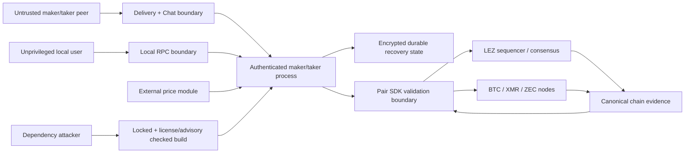

# Threat model

Status: draft — 2026-07-11

## Assets and actors

Assets are maker/taker funds on LEZ and the foreign chain, adaptor secrets or
HTLC preimages, Monero spend-key shares, wallet keys, persisted recovery state,
price configuration, and daemon control authority.

Actors are the maker operator, taker user, potentially malicious counterparty,
chain miners/sequencers, Logos Delivery/Chat peers, local unprivileged users,
and a supply-chain attacker.

## Non-negotiable invariants

1. The maker never locks before the taker's foreign lock reaches pair-specific
   confirmation policy.
2. After the first lock, claim and refund need only persisted state and chain
   nodes.
3. No reachable terminal or intermediate state lets one party receive proceeds
   while preventing the other from claiming or eventually refunding.
4. LEZ refund becomes available before the foreign refund, with a margin that
   covers inclusion delay, reorgs, clock drift, and operator reaction.
5. Every swap has independent IDs, secrets, keys, transactions, deadlines, and
   database writes.
6. A crash may delay progress but cannot erase the data required to recover.
7. Refund safety depends on chain state and deadlines, never on which party's
   refund observation reaches the coordinator first.

## Cross-cutting threats and required evidence

| Threat | Failure | Mitigation/evidence |
|---|---|---|
| Maker locks on zero/insufficient confirmations | Taker reorgs or abandons lock | State transition rejects maker lock; adapters prove canonical confirmations |
| Delivery/Chat outage or malicious messages | Locked funds become unavailable | Persist negotiated transcript before lock; post-lock API has no transport dependency |
| Rollback/reorg after observation | Coordinator acts on non-canonical evidence | Regression/removal before maker lock revokes permission and permits explicit replacement; after maker lock the exact txid stays pinned, claims suspend, and refunds remain; pair finality/chain tests remain |
| Deadline off-by-one or mixed clocks | Refund unavailable at documented boundary | Typed chain/basis positions reject cross-domain comparison; conservative cross-chain bounds validate margin; LEZ `[from,to)` and pair boundaries remain executable gates |
| Missing/corrupt local state | Claim/refund material lost | SQLite FULL durability, encrypted secret handling, backups, restart/process-kill matrix |
| Replay/duplicate chain event | Double transition or wrong swap mutation | Idempotency keys include pair, chain ID, txid, output index, and swap ID |
| Concurrent swap cross-talk | Wrong secret/account/UTXO used | Typed swap IDs, per-swap aggregates, DB primary keys, concurrent model/E2E tests |
| Local RPC takeover | Attacker changes price or triggers action | Current loopback adapter refuses remote bind and uses Bearer capability; production gate adds Unix peer permissions, credential file, least-privilege systemd unit, and audit log |
| Price-feed compromise | Economically harmful but valid swap | Bounds/staleness policy, operator limits, explicit source health; never weakens atomicity |
| Dependency compromise/license issue | Backdoor or redistribution failure | Lockfile, cargo-deny advisories/licenses/sources, minimal features, reviewed updates |

## Bitcoin-specific threats

- Adaptor pre-signature forgery or failed witness extraction: use a reviewed
  construction and DLC vectors; prove aEUF-CMA, witness extractability, and
  pre-signature adaptability assumptions.
- Refund fragility: ADR 0009 selects a consensus-enforced Taproot script-path CSV
  refund. Validate exact boundary, key backup, current-fee construction, RBF/CPFP,
  and reorg behavior against Bitcoin Core.
- Signature byte mutation: extraction depends on the accepted BIP-340 scalar.
  The sequencer-level LEZ byte-preservation reproducer is a release gate.
- UTXO replacement/fee starvation: bind exact outpoint/script/value and maintain a
  fee-bump path that cannot alter adaptor commitments.

## Monero-specific threats

- Invalid cross-curve DLEQ or subgroup handling: use COMIT/h4sh3d construction and
  published vectors; reject non-canonical points/scalars.
- Spend-key-share loss or partial transcript loss: persist encrypted shares and
  every signed recovery artefact before advancing.
- View/spend key confusion and wallet scan lag: separate typed keys and require
  canonical wallet/node observations before transitions.
- Counterparty disappears after witness exposure: recovery instructions must be
  derivable from persisted state without Chat.
- Unsupported XMR-first funding: the pinned COMIT construction requires the
  scriptable leg first, so core term validation and CLI/daemon reject XMR-first.

## Zcash-specific threats

- Transparent-pool privacy confusion: UI and docs state that amounts, scripts,
  addresses, and linkage are public; shield-after-swap is guidance, not a property
  of the atomic swap.
- BIP-199 script branch or CLTV error: canonical script vectors, minimal script,
  exact transaction-version/branch-ID tests, and third-party review.
- `nExpiryHeight` or reorg interaction: expiry is distinct from refund CLTV;
  construction and fee policy must leave enough blocks for both claim and refund.
- Node transition risk: use Zebra, construct locally with canonical Zcash crates,
  and pin network-upgrade behavior.

## Unresolved before Milestone 1 exit

- Quantified per-pair confirmation and timelock margins.
- Secret-at-rest encryption and operator backup/recovery policy.
- SPEL/current-LEZ compatibility and the precise witness authorization encoding.
