# Milestone 7 review-readiness packet

Status: active, repository-controlled preparation

This directory is the handoff surface for RFP-003 Milestone 7. It separates
work Gateway can complete and verify in this repository from the independent
judgement that only a mutually agreed reputable third party can provide.

The live RFP was reread at `logos-co/rfp` commit
`bff4bb291fa59fae70cb5310eb78d4e4d566a9a8`; its RFP-003 raw SHA-256 is
`a83d0b87ab32e459235a8fea7766519b7fe85ec99d7bcaf1dfe44d329bc3d498`.
Accepted replacement issue #112 was reread on 2026-08-04 and its normalized
body SHA-256 is
`593399d667d0187e591f0cb1814e12533830cd05b7fd50ce67ce5bcf672f7cf4`.

The required `logos-co/logos-docs` `doc-packet.yml` was captured from commit
`63ecf397ca5dae4b81de85a578ec839a78fec1c0`; the exact template SHA-256 is
`7f5a8507bd98bb54dfe4e1ab8b9e9e3a9bff8f3b64f1d1bbfa508a62fff4ccee`.
Each packet below contains every required field and all optional fields that
materially affect safe reproduction.

## Packet map

- [Mainnet-readiness write-up](mainnet-readiness.md)
- [Independent review scope and reproducible handoff](review-scope.md)
- [Finding severity and remediation register](findings-register.md)
- [Machine-auditable hard-requirement inventory](hard-requirements.tsv)
- [Machine-auditable submission-requirement inventory](submission-requirements.tsv)
- [F1/R3 actual-node dependency-loss certificate](../evidence/m7-unaffected-pair-outage-2c63218-20260804.json)
- [Actual-node Taker Tag14 and Monero claim-sweep certificate](../evidence/m7-actual-taker-claim-2cff48d-20260805.json)
- [Two-application actual-node BTC concurrency certificate](../evidence/m7-actual-btc-accepted-concurrency-272788c-20260808.json)
- [Joined actual-node Maker-refund certificate](../evidence/m7-actual-maker-refund-7cd3a9c-20260805.json)
- [Joined actual-node Maker-refund process-kill certificate](../evidence/m7-actual-maker-refund-process-kill-f8bee63-20260808.json)
- [Actual-node Maker Tag15 process-kill certificate](../evidence/m7-actual-maker-tag15-process-kill-e455dec-20260811.json)
- [Two-direction actual-node F7 custom-token refund certificate](../evidence/m7-actual-f7-custom-token-refund-062b6ba-20260808.json)
- [Maker-refund process-kill recovery decision](../architecture/0177-reconcile-killed-monero-refund-actors.md)
- [Custom-token refund routing decision](../architecture/0178-route-custom-token-refunds-through-asset-v2.md)
- [F7 verified host-deployer pin decision](../architecture/0179-pin-f7-host-deployer-build.md)
- [Refund observation-window decision](../architecture/0180-refresh-refund-observation-window.md)
- [Exact refund-miss uncertainty decision](../architecture/0181-preserve-exact-refund-miss-uncertainty.md)
- [Asset-aware refund effect-count decision](../architecture/0182-preserve-asset-aware-refund-effect-counts.md)
- [Canonical refund-transition evidence decision](../architecture/0183-use-canonical-refund-transition-evidence-names.md)
- [Asset-aware terminal-effect indexing decision](../architecture/0184-index-terminal-effects-by-asset-shape.md)
- [Tag-17 durable preparation and one-attempt release decision](../architecture/0158-prepare-and-release-tag17-once.md)
- [Supervised Maker Tag17 recovery decision](../architecture/0163-supervise-maker-tag17-recovery.md)
- [Durable Maker recovery branch-selection decision](../architecture/0164-select-maker-recovery-from-durable-branch.md)
- [Sealed finalized-refund extraction decision](../architecture/0165-seal-finalized-refund-signature-for-in-memory-extraction.md)
- [Non-mining Maker Monero refund sender decision](../architecture/0166-submit-maker-monero-refund-without-mining.md)
- [Read-only Maker refund finality decision](../architecture/0167-observe-maker-monero-refund-without-spend-authority.md)
- [Evidence-driven Maker refund activation decision](../architecture/0168-activate-maker-refund-from-finalized-evidence.md)
- [Pinned adaptor-journal custody decision](../architecture/0169-preserve-pinned-adaptor-journal-through-refund-activation.md)
- [Durable submission handoff decision](../architecture/0170-drive-refund-confirmations-from-durable-submission.md)
- [Semantic mutable-journal restart decision](../architecture/0171-validate-mutable-role-journals-semantically.md)
- [Retained refund-finality decision](../architecture/0172-retain-refund-finality-before-scoped-cleanup.md)
- [Taker-claim certificate CI decision](../architecture/0189-pin-taker-claim-certificate-in-ci.md)
- [Maker Tag15 owner-exact recovery decision](../architecture/0196-recover-maker-tag15-after-process-kill.md)
- [Maker all-pair action composition decision](../architecture/0197-compose-maker-all-pair-actions.md)
- [LEZ-BTC SDK journey](doc-packets/btc-sdk.md)
- [LEZ-XMR SDK journey](doc-packets/xmr-sdk.md)
- [LEZ-ZEC SDK journey](doc-packets/zec-sdk.md)
- [Maker CLI operator journey](doc-packets/maker-cli.md)
- [Taker CLI user journey](doc-packets/taker-cli.md)

## Completion rule

Repository-controlled preparation is complete only when its contract, all hard
requirement gates, clean role journeys, vulnerability/license checks, review
bundle, and exact cleanup pass from one pushed commit. Formal S12/S13 completion
then additionally requires the agreed reviewer report, remediation of every
Critical and High finding, and a recorded decision for every Medium and Low
finding. A self-review cannot satisfy that independent-review condition.

`./scripts/test-m7-hard-requirements-audit.sh` enforces the exact F1–F9,
U1–U10, R1–R8, and P1 inventory, one repository-owned executable gate and one
retained evidence source per row, and honest `green`, `open`,
`policy-deferred`, or `upstream-deferred` state. CI runs inventory mode while
work is active. The release-candidate command
`M7_REQUIRE_CLOSED=1 ./scripts/test-m7-hard-requirements-audit.sh` rejects every
repository-owned `open` row; approved public-evidence policy and Logos-owned
upstream disclosures remain visible without masquerading as implementation
work.

`./scripts/test-m7-submission-requirements-audit.sh` applies the same rule to
S1–S13 and D1. Its strict self-closure mode is
`M7_REQUIRE_SELF_CLOSED=1`; only S12 and S13 may use `external-review`, so no
other unfinished item can be mislabeled as somebody else's blocker.

```mermaid
flowchart LR
    Authority["Pinned RFP and accepted issue"] --> SelfWork["Gateway implementation and self-review"]
    SelfWork --> Audit["Exact F U R P inventory"]
    Audit --> Tests["Hard-requirement and security gates"]
    Tests --> Bundle["Immutable reviewer bundle"]
    Bundle --> External["Independent S12 and S13 review"]
    External --> Register["Finding register"]
    Register --> Remediation["Critical and High remediation"]
    Remediation --> Recheck["Independent closure check"]
    Recheck --> Release["M7 release decision"]
```

