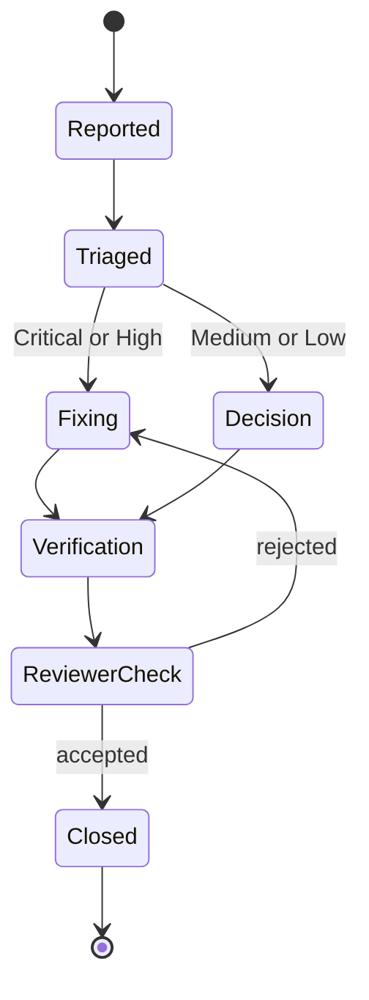

# M7 finding and remediation register

No independent report has been received. Rows are added without renumbering;
closed rows retain the original finding text, commit, verification and reviewer
closure. The reviewer owns finding severity; Gateway may record disagreement
but may not silently downgrade it.

## Severity policy

| Severity | Release treatment | Required evidence |
|---|---|---|
| Critical | Block release; remediate | regression test, fix commit, full affected gates, reviewer closure |
| High | Block release; remediate | regression test, fix commit, full affected gates, reviewer closure |
| Medium | Remediate or document explicit owner-reviewed risk decision | exploitability analysis, compensating controls, tests and disposition |
| Low | Remediate or document explicit owner-reviewed disposition | rationale, affected surface and validation |
| Informational | Track a documented decision | rationale or follow-up reference |

## Findings

| ID | Review | Severity | Surface | Summary | State | Remediation or decision | Verification | Reviewer closure |
|---|---|---|---|---|---|---|---|---|
| None | Pre-review | Informational | Repository | Independent S12/S13 review has not started; this sentinel is replaced only by numbered findings from the agreed report | Open external gate | Complete repository-controlled preparation, then provide the immutable candidate to the agreed reviewer | M7 readiness contract and release dossier | Not requested |

## State flow

