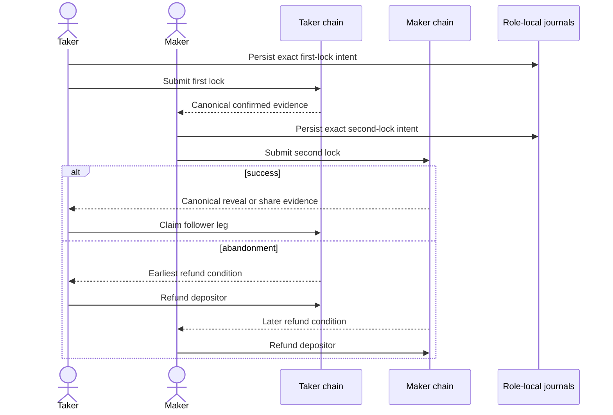

# Mainnet-readiness write-up

This write-up satisfies the repository-controlled S7 deliverable. It is a
release assessment, not a claim that the current private local build is ready
for mainnet. The authoritative detailed component, RPC, actor, and pair
sequences remain in [system architecture](../architecture/system-architecture.md)
and [deployment components](../architecture/deployment-components-and-rpcs.md).

## Per-chain protocol designs

- Bitcoin uses a two-party MuSig2/BIP-340 adaptor construction for the
  cooperative BIP-341 key-path claim and a committed CSV Taproot script-path
  refund. Canonical transaction bytes, outpoint, value, keys, control block,
  fee and schedule are agreement-bound.
- Monero uses the h4sh3d-shaped secp256k1/Ed25519 cross-curve DLEQ and spend-key
  share transfer construction. Only LEZ-first is supported. Finalized LEZ
  witnesses gate release, and actual Monero wallet evidence gates completion.
- Zcash uses a transparent BIP-199-style SHA-256/CLTV HTLC. LEZ reveals or
  refunds first; the later Zcash deadline retains a conservative recovery
  margin. Shielded pools are outside the accepted scope.

## LEZ escrow design

The LEZ Vault program supports native LEZ and Token/ATA custody. Its Risc0
guest validates the operation-specific initialize, fund, witnessed claim, and
refund transition. The main process does not synthesize finalized facts: an
isolated version-pinned sidecar constructs and validates official wire bytes,
and the actor journals exact request identity before submission. Finalized
containing-block evidence, stable-tip evidence, escrow identity, participants,
asset, amount, and branch are checked before projection.

ADR 0151 makes the SPEL IDL the single source for both deployment and runtime
clients. Exact IDL/client digests plus semantic account-order and signer-role
assertions bind the current custody ABI to the local artifact manifest. This is
interface integrity evidence, not a claim of public deployment or independent
review.

## Cross-chain atomicity arguments

Atomicity is conditional economic safety, not one transaction spanning two
chains. The taker locks first; the maker lock is inadmissible until the exact
first lock reaches the agreement's confirmation policy. On the success branch,
the adaptor secret, spend-key share, or HTLC preimage disclosed by the revealing
leg authorizes the follower leg. On abandonment, ordered deadlines preserve
both depositor refund paths. Durable intent/outcome journals and immutable swap
identities make retries converge without changing branch meaning.

This guarantee depends on canonical-chain evidence, validated cryptographic
constructions, conservative timelocks and at least one party remaining able to
submit before its safety window closes. It does not promise simultaneous wall
clock settlement, guaranteed liveness during total chain outage, or safety
after both parties lose their protected recovery state.

## Timelock handling

Agreements name immutable chain-specific confirmation, clock, cutoff, and
margin policies. Bitcoin uses height/CSV domains; Zcash uses height/CLTV; LEZ
uses finalized chain time with explicit seconds/milliseconds conversion; Monero
release is canonical-event gated rather than represented as a fictitious shared
deadline. Admissions use fresh containing-block and stable-tip observations.
Late or regressed evidence suspends forward progress and never silently changes
the pinned transaction. Public calibration under representative congestion and
reorg conditions remains a release gate.

## Security assumptions

- secp256k1, Ed25519, SHA-256, MuSig2, adaptor, DLEQ, Taproot, Zcash Script and
  Risc0 primitives behave under their documented assumptions;
- the selected third-party review validates their exact composition here;
- chain nodes report authentic canonical data and finality policies cover the
  deployment's realistic reorg envelope;
- role hosts protect signing material, SQLite encryption keys, Unix sockets,
  node credentials and recovery backups;
- at least one authorized role process can observe and submit during each
  live recovery window;
- build and runtime artifacts match the recorded source, locks and digests.

## Known limitations

The project is currently certified only on isolated private local networks.
No public RPC, faucet, public funds or public deployment is represented by that
evidence. S12/S13 independent review is outstanding. Public-network timelock and
fee calibration, durable rollback anchoring, cold reproducible Logos UI supply
chain/licensing closure, and the open Logos/upstream items in
[the production blocker register](../upstream-production-blockers.md) remain
release gates. XMR-first, shielded Zcash, ETH and automatic legal/regulatory
policy decisions are out of scope. Operators remain responsible for deployment
jurisdiction, asset policy, sanctions and other applicable obligations.

## Operations runbook

1. Select only immutable, reviewed source, dependency locks, images, LEZ program
   artifacts and signed configuration; verify every documented digest.
2. Provision separate Maker and Taker users, mode-0700 state directories,
   mode-0600 Unix sockets/credentials, encrypted recovery stores and tested
   offline backups. Never share actor stores or wallet credentials.
3. Configure authenticated self-hosted chain RPCs, exact network/genesis
   identities, conservative finality/timelock profiles, fee policy, bounded
   response sizes and health alarms. Public endpoints require a separate trust
   decision and must not be introduced as an implicit fallback.
4. Deploy the reviewed LEZ program for the target network and record its program
   ID, guest ImageID/ELF digest, deploy transaction and activation height.
5. Start the daemon with only reviewed pair routes enabled. Verify health,
   external-price fail-closed behavior, signed Delivery identity, Chat custody,
   node freshness and recovery-store access before advertising liquidity.
6. Rehearse a low-value happy and refund swap for every enabled pair. Verify the
   exact chain effects and terminal no-effect replay before raising limits.
7. Monitor node freshness, confirmation regression, deadlines, stalled effects,
   replay conflicts, store integrity, disk, process generations and dependency
   vulnerability alerts. Withdrawal of one unhealthy route must leave healthy
   pairs available.
8. On failure, stop new offers without deleting state; preserve logs without
   secrets; use the role-local journal plus canonical nodes to complete/refund;
   rotate compromised credentials; and restore only from integrity-checked
   backups. Never retry an ambiguous effect with changed bytes or identity.
9. For upgrades, drain new negotiation, retain recovery workers, migrate one
   backed-up role store, re-run exact replay and refund drills, then roll out by
   pair. Rollback must not cross a schema or program version without an explicit
   compatible procedure.
