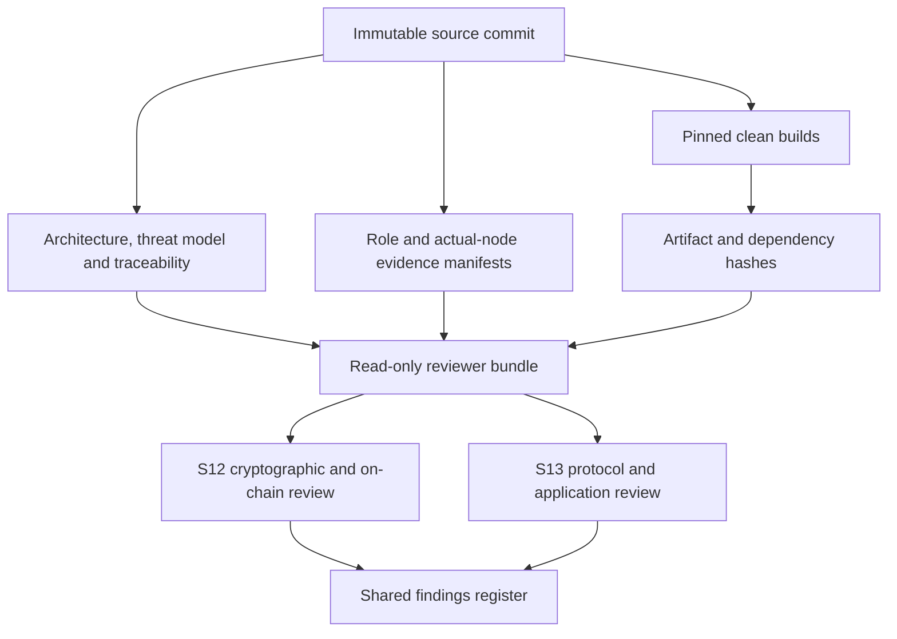

# Independent review scope and handoff

This packet defines the minimum S12/S13 scope. It does not constrain the
reviewer from expanding the review when dependencies or composition demand it.

## Required review surfaces

| Scope | Primary repository surface | Required judgement |
|---|---|---|
| LEZ escrow Rust and Risc0 | `compat/spel-zec-escrow`, `compat/lez-v0.2-provisional/escrow`, v0.2 sidecar | custody, authorization, recursive/witnessed transition correctness, byte/program identity, claim/refund exclusion |
| Bitcoin Taproot and pre-signed transactions | `crates/adaptor-signature`, `crates/btc-swap-sdk`, `crates/btc-core-adapter` | BIP-340/341/327 composition, nonce/session binding, adaptor security, key-path claim, CSV refund, fee/reorg behavior |
| Zcash transparent HTLC | `crates/zec-swap-sdk`, `crates/zebra-node-adapter` | exact BIP-199 Script/stack/CLTV semantics, transaction construction, preimage/refund order and canonical observation |
| Monero adaptor and cross-curve DLEQ | `crates/xmr-swap-sdk`, `crates/xmr-reference-actor`, `crates/xmr-monero-adapter` | DLEQ domains/encoding/subgroups, share ownership/release, spend-key recovery and one-direction protocol atomicity |
| Coordinator state machine | `crates/swap-core`, `crates/swap-store`, Maker/Taker supervisors | taker-first invariant, durable branch authority, restart, uncertain effects, replay, concurrency, deadlines and recovery |
| Daemon authentication and IPC | `crates/maker-node`, `crates/logos-price-c-api`, `apps/basecamp` | local authorization, socket/file custody, bounded parsing, C ABI isolation, role separation and GUI privilege boundary |

## Protocol questions the report must answer

1. Under exactly which cryptographic, chain-finality, timing, fee, storage and
   process-availability assumptions can either participant avoid principal loss?
2. Can any wire, transcript, nonce, adaptor point, DLEQ proof, preimage, share,
   transaction, swap ID, asset or participant identity be replayed or substituted
   across roles, pairs, directions, networks, sessions or branches?
3. Is taker-first ordering enforced at every effect boundary, including restart,
   reorg, response loss, concurrent workers and late observations?
4. Do all success and abandonment interleavings retain a valid follower claim
   or depositor refund, and are unsafe half-states represented as nonterminal?
5. Can a corrupted/rolled-back store, compromised local client, unavailable RPC,
   malformed node response or process kill authorize a second meaning/effect?
6. Are the stated Bitcoin, Monero and Zcash constructions implemented exactly,
   and are theorem/security claims appropriately scoped to the composition?

## Reproducible handoff

The reviewer receives one immutable commit and annotated review-candidate tag;
source and submodule identities; all Cargo/NPM/Nix locks; generated program and
IDL manifests; retained actual-node evidence; architecture/threat/atomicity
documents; dependency/vulnerability reports; and command transcripts from the
same commit. Generated binaries and videos are accompanied by SHA-256 manifests
and rebuild/replay commands. No private keys, wallet seeds, API tokens, live
funds or reusable credentials are included.

## Exclusions that are not waivers

Public deployment credentials, funds and operator legal decisions are not
provided to a reviewer. Logos-owned upstream defects remain listed as release
risks, but they do not waive review of repository-controlled validation or
compensating controls. Prior milestone tags establish local evidence only and
do not substitute for independent review.

