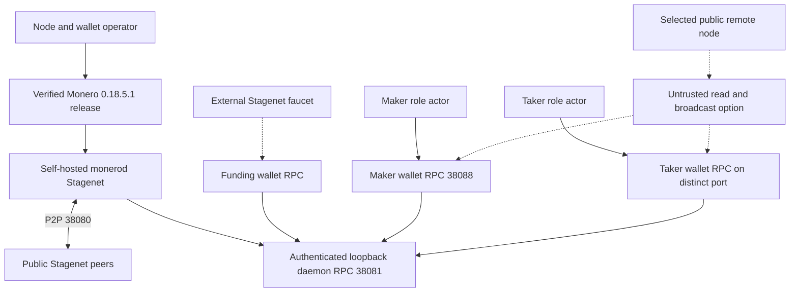

# Monero Stagenet node, wallet RPC, and funding guide

Status: self-hosted and untrusted public-route procedures documented and
contract-tested; no live public Stagenet swap or production-readiness claim.

This guide covers RFP U9: run `monerod` and `monero-wallet-rpc` on
Stagenet, obtain valueless Stagenet XMR, and understand public remote-node
trust. Retained M4/M5 certificates use official Monero 0.18.5.1 Regtest and
deterministic local funds. **No public Stagenet** RPC, peer, faucet, funds,
transaction, or external finality service participated in those certificates.

## What to build and test first

```sh
rustup show
cargo build --locked -p lez-xmr-swap-sdk -p lez-xmr-monero-adapter
./scripts/test-monero-stagenet-guide-contract.sh
cargo test --locked -p lez-xmr-monero-adapter --all-targets
```

These checks make no public chain call after locked build dependencies are
available. The deterministic complete local procedure remains in
`docs/manual-user-flows.md`; Regtest evidence must not be relabeled Stagenet.

## Components, RPCs, and authorities



The node never receives wallet keys. Each wallet RPC owns one wallet,
credential, directory, and role. Funding authority is not passed to a swap
actor. A public node can observe metadata and return stale, selective, or false
data; it is not independent consensus or privacy authority.

## Pin and verify the official release

The repository pins Monero `0.18.5.1` / `v0.18.5.1`, source commit
`4f92268d7c16741cfb41e5bbe2aa46cc260a9ea5`, and Linux archive SHA-256
`22a7dda7b0cb699fdd6b7674c3b4a4465b337cc98a54983523b759e1e7cc9958`.
The verifier checks the retained signed hash list and signer fingerprint,
archive hash/size/members, tag object/commit, and extracted versions.

```sh
export STAGENET_ROOT="$HOME/.local/share/lez-xmr-stagenet"
install -d -m 0700 "$STAGENET_ROOT/cache" \
  "$STAGENET_ROOT/evidence" "$STAGENET_ROOT/release"
export MONERO_CACHE_DIR="$STAGENET_ROOT/cache"
export MONERO_BUILD_CONTEXT="$STAGENET_ROOT/release/context"
export MONERO_PROVENANCE_EVIDENCE="$STAGENET_ROOT/evidence/provenance.json"
./scripts/verify-monero-release.sh
```

Outputs are create-new. Use fresh absolute output paths on repeat. An exact
preseeded archive supplied by `MONERO_ARCHIVE_PATH` is still fully revalidated.
Cold verification requires the official archive and an exact live Git-tag
identity check. Extract the verified archive into an owner-private directory
and set `MONERO_BIN` to its `bin` directory.

## Self-hosted Stagenet node

Standard Stagenet ports are P2P `38080`, unrestricted JSON-RPC `38081`,
ZMQ `38082`, wallet RPC `38088`, and restricted RPC `38089`. Only P2P
needs public reachability. Keep administrative RPC on literal loopback.

Create a mode-0600 `$STAGENET_ROOT/monerod.conf`:

```ini
stagenet=1
data-dir=/home/OPERATOR/.local/share/lez-xmr-stagenet/node
log-file=/home/OPERATOR/.local/share/lez-xmr-stagenet/log/monerod.log
p2p-bind-ip=0.0.0.0
p2p-bind-port=38080
rpc-bind-ip=127.0.0.1
rpc-bind-port=38081
rpc-login=lez-node:REPLACE_WITH_RANDOM_PASSWORD
no-zmq=1
check-updates=disabled
prune-blockchain=1
```

Use actual absolute owner paths and a distinct random secret. Keeping
`--rpc-login` in the private config avoids credentials in argv/history.
Start as a dedicated unprivileged user:

```sh
"$MONERO_BIN/monerod" \
  --config-file "$STAGENET_ROOT/monerod.conf" \
  --non-interactive
```

Do not use `--offline`: Stagenet requires public P2P sync. Do not publish
unrestricted RPC. A public service requires restricted RPC plus separate
transport, privacy, rate-limit, and operations review.

### Node readiness

```sh
curl --fail --silent --show-error --digest \
  --user "$MONEROD_RPC_LOGIN" --header 'Content-Type: application/json' \
  --data '{"jsonrpc":"2.0","id":"ready","method":"get_info"}' \
  http://127.0.0.1:38081/json_rpc
curl --fail --silent --show-error --digest \
  --user "$MONEROD_RPC_LOGIN" --header 'Content-Type: application/json' \
  --data '{"jsonrpc":"2.0","id":"peers","method":"get_connections"}' \
  http://127.0.0.1:38081/json_rpc
curl --fail --silent --show-error --digest \
  --user "$MONEROD_RPC_LOGIN" http://127.0.0.1:38081/get_height
```

Require `nettype=stagenet`, `stagenet=true`, `offline=false`, non-busy
state, height close to target height, validated peers, and a fresh tip. The
adapter must also bind network/genesis, canonical block/transaction/output,
confirmations, and stable re-observation. Self-reported sync is not global
freshness proof; monitor peer diversity and an independent source.

## Separate wallet RPC configuration

Create one mode-0700 wallet directory and mode-0600 config for Funding, Maker,
and Taker. Every config selects `--stagenet`, the authenticated daemon, a
distinct loopback port, and distinct `--rpc-login`. Never use
`--trusted-daemon` with a public remote node.

Example Maker config:

```ini
stagenet=1
wallet-dir=/home/OPERATOR/.local/share/lez-xmr-stagenet/maker-wallet
daemon-address=http://127.0.0.1:38081
daemon-login=lez-node:REPLACE_WITH_NODE_PASSWORD
rpc-bind-ip=127.0.0.1
rpc-bind-port=38088
rpc-login=maker:REPLACE_WITH_DISTINCT_RANDOM_PASSWORD
log-file=/home/OPERATOR/.local/share/lez-xmr-stagenet/log/maker-wallet-rpc.log
non-interactive=1
```

```sh
"$MONERO_BIN/monero-wallet-rpc" \
  --config-file "$STAGENET_ROOT/maker-wallet-rpc.conf"
```

Repeat on disjoint ports, credentials, and directories for Taker and Funding.
Never share a seed, view key, wallet directory, or credential between roles.
The local topology proves wrong-role credential replay returns HTTP 401.

Create disposable wallets using `monero-wallet-cli --stagenet
--generate-new-wallet`, record each mnemonic offline, and open it only in its
corresponding wallet RPC. Verify authenticated wallet RPC:

```sh
curl --fail --silent --show-error --digest \
  --user "$MAKER_WALLET_RPC_LOGIN" --header 'Content-Type: application/json' \
  --data '{"jsonrpc":"2.0","id":"address","method":"get_address"}' \
  http://127.0.0.1:38088/json_rpc
curl --fail --silent --show-error --digest \
  --user "$MAKER_WALLET_RPC_LOGIN" --header 'Content-Type: application/json' \
  --data '{"jsonrpc":"2.0","id":"balance","method":"get_balance"}' \
  http://127.0.0.1:38088/json_rpc
```

Wait for wallet refresh to reach canonical daemon height and for outputs to be
unlocked. Daemon inclusion alone is not spendability.

## Obtain and verify Stagenet funds

The official network guide currently lists XMR-TW and CypherFaucet Stagenet
faucets. These community services have no repository-controlled identity,
uptime, quota, amount, privacy, or correctness guarantee. Never make a faucet a
required CI dependency or disclose wallet secrets.

1. Generate a disposable Funding-wallet subaddress with `get_address` or
   `create_address`.
2. Request Stagenet XMR from an operator-selected faucet.
3. Independently observe the returned txid through the self-hosted node/wallet.
4. Wait until `get_balance` reports sufficient unlocked balance.
5. Use Funding wallet RPC `transfer` to fund the exact agreement-bound shared
   address.
6. Verify amount, destination public keys, unlock state, confirmations, and
   stable canonical transaction before share release.

Keep a separately controlled pre-funded Stagenet wallet for scheduled tests:
faucets are best-effort. Coins are valueless by convention, but identities and
network metadata remain sensitive.

## Public remote node option

A **Public remote node** is an untrusted compatibility option, not the default.
Official guidance warns that remote operators may log IPs and transaction IDs
and recommends Onion or I2P when unavoidable. Select and pin one reviewed
Stagenet endpoint per run and set wallet behavior to `--untrusted-daemon`.
Never enable trusted-daemon, allow version mismatch, silently fail over, or
merge disagreeing observations.

Require the same network, height, freshness, block, transaction/output, and
stable re-observation checks as self-hosting. Bound bytes, time, and concurrency.
Malformed responses, missing trust flags, disagreement, quotas, outages, and
ambiguous broadcast fail closed. The repository's production-accepted adapter
route remains authenticated literal-loopback; public Stagenet is a documented
operator/future reviewed transport profile, not a working implicit fallback.

Prefer an authenticated tunnel to an operator-controlled node. A third-party
node can censor, delay, equivocate, and correlate queries even though it cannot
directly derive spend keys; it must not be sole production finality authority.

## Manual swap rehearsal

Once a reviewed Stagenet transport profile exists, reuse the same binaries,
SDK, actors, and journals as Regtest. Only signed configuration for network,
genesis, RPC/authentication, funds, confirmations, and calibrated timeouts may
change.

1. Verify releases/source and run deterministic SDK/actor gates.
2. Record node version, network/genesis, height/target, peers/freshness, and
   exact endpoint without credentials.
3. Start separate Funding, Maker, and Taker wallets; prove wrong-role auth fails.
4. Fund and stably verify the countersigned shared output.
5. Run one low-value LEZ-first happy claim; verify finalized LEZ reveal,
   extraction, Monero sweep, and exact accounting.
6. Run signed refund after the canonical LEZ event; verify Maker-only recovery.
7. Rehearse restart, response loss, and two concurrent swaps with disjoint
   wallets, stores, sessions, nonces, key images, and effects.
8. Retain secret-free evidence and remove only run-owned temporary resources.

Until then, follow `docs/manual-user-flows.md` Flows 0 and 1R-1W. They use
actual official Monero processes but do not measure public peers, reorgs,
funding, fees, or latency.

## Security, recovery, and cleanup

- Use distinct unprivileged role users where practical and owner-only paths.
- Never log or record seeds, keys, DLEQ scalars, shares, RPC secrets, or raw
  recovery journals.
- Back up and restore-test seeds plus encrypted journals before funding.
- Disable new offers during lag/upgrade while keeping recovery alive.
- Reconcile exact tx identity before retrying any ambiguous submission.
- Stop wallet RPCs, then `monerod`; delete only named run paths after every
  funded swap is terminal, retaining review evidence.

## External resources and flakiness

| Resource | Needed | Authority | Flakiness and control |
|---|---:|---|---|
| Official Monero 0.18.5.1 archive and Git tag | Cold setup | Monero signer/source | DNS/TLS/Git/download outage; retained signed hashes and exact cache revalidation |
| Stagenet P2P peers | Self-hosted rehearsal | Public peers | Sync, partition, eclipse, reorg, latency; monitor diversity/freshness |
| Public remote node | Optional | Third-party operator | Logging, censorship, equivocation, lag, quotas/outage; untrusted mode, privacy transport, no failover |
| Community faucet | Optional funding | Community operator | No SLA, quota/depletion and privacy/correctness uncertainty; pre-funded wallet and independent observation |
| Self-hosted daemon/wallet RPC | Recommended | Local operator | Disk/process/scan lag and port conflict; authentication and health alarms |
| LEZ public deployment | Not used locally | Logos/operator | Separate identity/deployment gate; no public claim in local M7 preparation |

