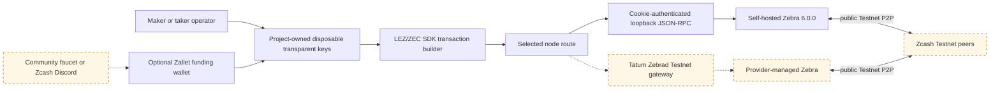

# Zcash public-testnet node, wallet, and funding guide

Status: self-hosted and public-provider routes selected on 2026-07-13; live corridor execution
and clean-machine rehearsal pending.

This guide separates what an operator can configure today from the missing M2
implementation. It does not claim a passing public-testnet swap. The primary
route is a self-hosted Zebra JSON-RPC endpoint. No Zcash Foundation-operated
public Zebra JSON-RPC service was found. Tatum's documented Zebrad-powered
Testnet gateway is the selected public-provider route; it is not interchangeable
with lightwalletd gRPC, and it remains unavailable to this project until the
HTTPS credential transport and exact method contract pass a live rehearsal.



## Proven facts and current blockers

- Zebra 6.0.0 is the current stable release and includes NU6.3 plus P2SH
  mempool hardening. Use the signed release or exact `v6.0.0` tag; do not follow
  a moving branch. See the [Zebra 6.0 release](https://zfnd.org/zebra-6-0-0-release/)
  and [GitHub tag](https://github.com/ZcashFoundation/zebra/releases/tag/v6.0.0).
- Zebra is the consensus oracle and broadcaster. librustzcash construction or
  parser success alone is not consensus evidence.
- Tatum documents a dedicated Zebrad JSON-RPC endpoint at
  `https://zcash-testnet-zebrad.gateway.tatum.io`, API-key authentication, a
  free Testnet key, and a separately monitored Testnet Zebrad status component.
  This is a third-party authoritative-node route, not independent consensus
  proof or an official Zcash Foundation service. See Tatum's
  [Zebrad gateway announcement](https://docs.tatum.io/changelog/zcash-zebrad-rpc-support-added),
  [Zcash authentication guidance](https://tatum.io/chain/zcash), and
  [status page](https://status.tatum.io/).
- Zallet `v0.1.0-alpha.4` can create a testnet account, expose a transparent
  P2PKH receiver, and send ordinary transparent funds. It cannot export its
  HD-derived transparent private keys or sign arbitrary raw/PCZT HTLC
  transactions. Its `z_exportkey` support is Sapling-only, while raw create,
  fund, and sign replacements remain unfinished. See the
  [Zallet release](https://github.com/zcash/zallet/releases/tag/v0.1.0-alpha.4),
  [export-key implementation](https://github.com/zcash/zallet/blob/v0.1.0-alpha.4/zallet/src/components/json_rpc/methods/export_key.rs),
  and [RPC migration table](https://github.com/zcash/zallet/blob/main/book/src/zcashd/json_rpc.md).
- Therefore the corridor still needs project-owned disposable transparent key
  custody and signing. Zallet is optional funding infrastructure, not the swap
  signer. Never import production seeds to bridge this gap.
- Zallet alpha.4 documents NU6.2 support, while Zebra 6.0 schedules NU6.3 at
  Testnet height 4,134,000. Treat Zallet as fail-closed until its reported sync
  and branch compatibility are verified for the current tip.

## Isolated self-hosted Zebra route

### Prerequisites

- Rust toolchain capable of building the exact Zebra tag, or its signed release
  binary.
- Roughly 10 GB free state space and potentially half a day for initial sync
  under favorable conditions. See the official
  [requirements](https://zebra.zfnd.org/user/requirements.html) and
  [troubleshooting guide](https://zebra.zfnd.org/user/troubleshooting.html).
- Unique, owner-controlled state, cookie, log, and configuration directories.
- Caller-selected unused loopback RPC and P2P ports. Do not assume the example
  ports are free and do not overlap repository Regtest/Docker runs.

Install the pinned source build if a verified binary is not used:

```sh
cargo install --locked --git https://github.com/ZcashFoundation/zebra \
  --tag v6.0.0 zebrad
```

Generate a configuration into a run-specific directory:

```sh
export RUN_ID="manual-zec-testnet-a"
export RUN_DIR="/tmp/lez-atomic-swaps-${RUN_ID}"
install -d -m 700 "$RUN_DIR/state" "$RUN_DIR/cookie"
zebrad generate -o "$RUN_DIR/zebrad.toml"
```

Set these supported fields in `zebrad.toml`, choosing verified-free loopback
ports rather than copying a concurrently used value:

```toml
[network]
network = "Testnet"
listen_addr = "127.0.0.1:18233"

[state]
cache_dir = "/tmp/lez-atomic-swaps-manual-zec-testnet-a/state"

[rpc]
listen_addr = "127.0.0.1:18232"
cookie_dir = "/tmp/lez-atomic-swaps-manual-zec-testnet-a/cookie"
enable_cookie_auth = true
```

Do not customize public Testnet consensus parameters. Start with:

```sh
zebrad -c "$RUN_DIR/zebrad.toml" start
```

The official [Zebra Book](https://zebra.zfnd.org/) documents configuration,
startup, and cookie-authenticated curl. RPC is disabled until `listen_addr` is
set. Keep it on loopback: a public bind permits untrusted state queries and
transaction submission.

### Required preflight

Use the cookie file without printing it or enabling shell tracing. Query
`getblockchaininfo` and require:

- `chain` is `test`;
- `verificationprogress` is effectively synchronized;
- `blocks` is close to `estimatedheight`; and
- `consensus.next_block` identifies the epoch used to build and sign the next
  transaction.

Never hardcode the branch ID for a long-running test. NU6.2 used branch
`0x5437f330`; NU6.3 uses `0x37a5165b`. Re-query immediately before signing and
rebuild/re-sign if the epoch changes. The authoritative branch mapping is in
[`zcash_protocol`](https://github.com/zcash/librustzcash/blob/main/components/zcash_protocol/src/consensus.rs).

The manual corridor will require at least `getblockchaininfo`, `getblockcount`,
`getblock`, `getrawtransaction`, `gettxout`, and `sendrawtransaction`. Confirm
the exact surface with `rpc.discover`; see Zebra's
[RPC trait](https://zebra.zfnd.org/internal/zebra_rpc/methods/trait.RpcServer.html).

## Public Zebrad provider route

Create a dedicated Testnet API key in Tatum and keep it in an owner-readable
credential source. The documented endpoint is:

```text
https://zcash-testnet-zebrad.gateway.tatum.io
```

Use the recommended `x-api-key` header. Never place the key in a URL, source,
shell history, test snapshot, debug output, or recording. Before enabling a
swap, query `getblockchaininfo` and enforce the same Testnet, sync, tip, and
`consensus.next_block` checks as the self-hosted route. Then smoke every method
the actor needs: `getblockcount`, `getblockhash`, `getblock`,
`getrawtransaction`, `getrawmempool`, `gettxout`, and `sendrawtransaction`.
Method discovery and unauthenticated availability alone are not sufficient.

The current production adapter intentionally accepts literal loopback HTTP only,
so it cannot yet consume this route. The public transport must be a separate
configuration that requires HTTPS, a bounded sensitive API-key header, no URL
credentials, bounded response bodies/time/concurrency, and no automatic retry
of `sendrawtransaction` after an unknown outcome. Validate returned chain,
branch, genesis, block, transaction, and stable-tip facts exactly as on the
self-hosted route. Where practical, cross-check read evidence against the
self-hosted node; never merge disagreeing observations or silently fail over
between nodes during a state transition.

## Disposable transparent wallet and funds

The intended swap address is produced by project-owned testnet key custody,
which is not implemented yet. Once it exists, record only its `tm...` address
and never log its secret key.

The official Zcash testnet guide currently points users to Zcash Discord support
or the community `https://faucet.zecpages.com/` faucet. See the
[official testnet guide](https://zcash.readthedocs.io/en/latest/rtd_pages/testnet_guide.html).
The faucet has no documented current SLA, rate limit, or dispense amount and was
unresponsive during the 2026-07-12 research check. It must never be a required CI
gate. Record any returned transaction ID and independently verify it through the
operator's Zebra node. Keep a separately controlled pre-funded test wallet as a
fallback for scheduled evidence runs.

### Optional Zallet funding wallet

Pin Zallet `v0.1.0-alpha.4`, use the `zallet-zaino` backend, bind its RPC only to
loopback, and point `validator_address` plus `validator_cookie_path` at the
self-hosted Zebra instance. Follow the official
[setup guide](https://github.com/zcash/zallet/blob/v0.1.0-alpha.4/book/src/guide/setup.md)
and pinned
[example configuration](https://github.com/zcash/zallet/blob/v0.1.0-alpha.4/zallet/tests/cmd/example_config.out/zallet.toml).

After full wallet sync, the supported funding flow is:

1. `z_getnewaccount` for a disposable funding account.
2. `z_getaddressforaccount` requesting `sapling` and `p2pkh` receivers.
3. `z_listunifiedreceivers` and extract the `p2pkh` `tm...` receiver.
4. Obtain TAZ at that funding receiver.
5. Use `z_sendmany` with the explicit `AllowFullyTransparent` privacy policy to
   send TAZ to the project-owned swap address.
6. Poll `z_getoperationstatus`/`z_getoperationresult`, then verify the outpoint
   independently with Zebra `gettxout`.

Zallet's database contains cleartext history and viewing material even though
key material uses age encryption. Keep the database, age identity, and mnemonic
owner-only; never rely on the mnemonic to recover standalone keys. Its alpha RPC
is not a production custody boundary.

## Public-testnet corridor rehearsal

This section remains blocked until project-owned transparent signing and the
actual public-testnet actor adapter exist. The eventual rehearsal must:

1. build the workspace and exact SDK with `cargo build --locked`;
2. start independent maker and taker processes with separate keys and state;
   run the evidence suite once through self-hosted Zebra and once through the
   selected Tatum Zebrad route rather than switching a live swap mid-effect;
3. query and record node version, height, sync state, and next consensus branch;
4. verify funded transparent outpoints before negotiation;
5. construct, decode, and broadcast canonical standard BIP-199 funding, claim,
   and refund transactions;
6. retain transaction IDs, block heights, confirmations, actor role, direction,
   and exact commit under test;
7. repeat happy, counterparty-abandonment/refund, restart, and concurrency flows;
8. shield received transparent funds in a separate wallet action and document
   that shielding is not part of atomicity; and
9. fail closed on an epoch change, stale node, RPC/auth error, or inconsistent
   observation.

Public Testnet is inherently dependent on peer availability, initial sync,
faucet or pre-funded-wallet availability, activation timing, and organic reorgs.
Keep deterministic Regtest as the required per-commit consensus lane; run public
Testnet as an opt-in or scheduled compatibility lane whose failures retain
diagnostic evidence and are never silently ignored.

## Security, privacy, and cleanup

- Transparent sender, recipient, amount, and transaction graph are permanently
  public. Use disposable Testnet identities and never reuse mainnet keys,
  addresses, seeds, cookies, or provider credentials.
- Keep Zebra and Zallet RPC on loopback. Never put cookie contents, mnemonics,
  WIFs, raw private material, or shell traces in CI logs or recordings.
- Testnet TAZ has no monetary value, but credentials and linkage metadata remain
  sensitive.
- Stop Zallet and Zebra before removing only the run-specific directory. Preserve
  the state and evidence directory when a result will support an M2 acceptance
  claim; record its owner, commit, tool versions, and hashes.

## External-resource and flakiness summary

| Resource | Required today | Authority | Flakiness / limitation |
|---|---:|---|---|
| Self-host Zebra 6.0.0 | Selected for future public testnet | Local operator; public consensus peers | Initial sync, disk, DNS/P2P, epoch transitions |
| Tatum Testnet Zebrad JSON-RPC | Selected public-provider route; live contract pending | Tatum API-key gateway and provider-managed Zebra | Account/key provisioning, quotas, outage, method policy, lag, and provider trust; never substitute generic Zcash RPC or lightwalletd |
| Community faucet | Optional | External community operator | No SLA/current limits; may time out or be depleted |
| Zcash Discord funding request | Optional fallback | External support process | Manual response and availability |
| Zallet alpha.4 | Optional funding wallet only | Local operator | Alpha compatibility; no arbitrary HTLC signing; NU6.3 must be reverified |
| Project transparent signer | Required repository work | Independent maker/taker | Not implemented; no public-testnet corridor can pass without it |
